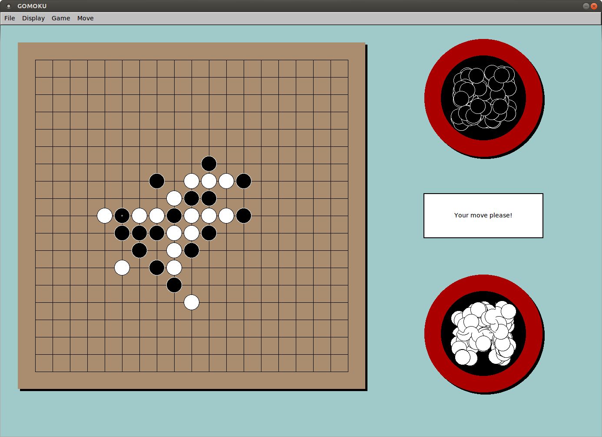

# fgomoku

*A quick conversion of a gomoku program written in the year 2000
 with `GraphApp2` to `FLTK` in the year 2018.*

`v1.0  04/04/2018`

I didn't want to touch the code more than necessary, so
I built a lot of wrapper functions that translate `GraphApp`
to `FLKT`. Only some too complicted things (like menus) have
been adapted.
